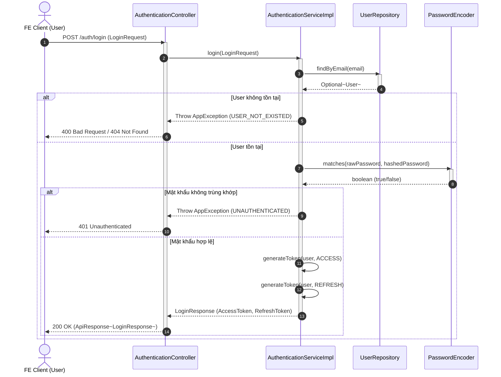
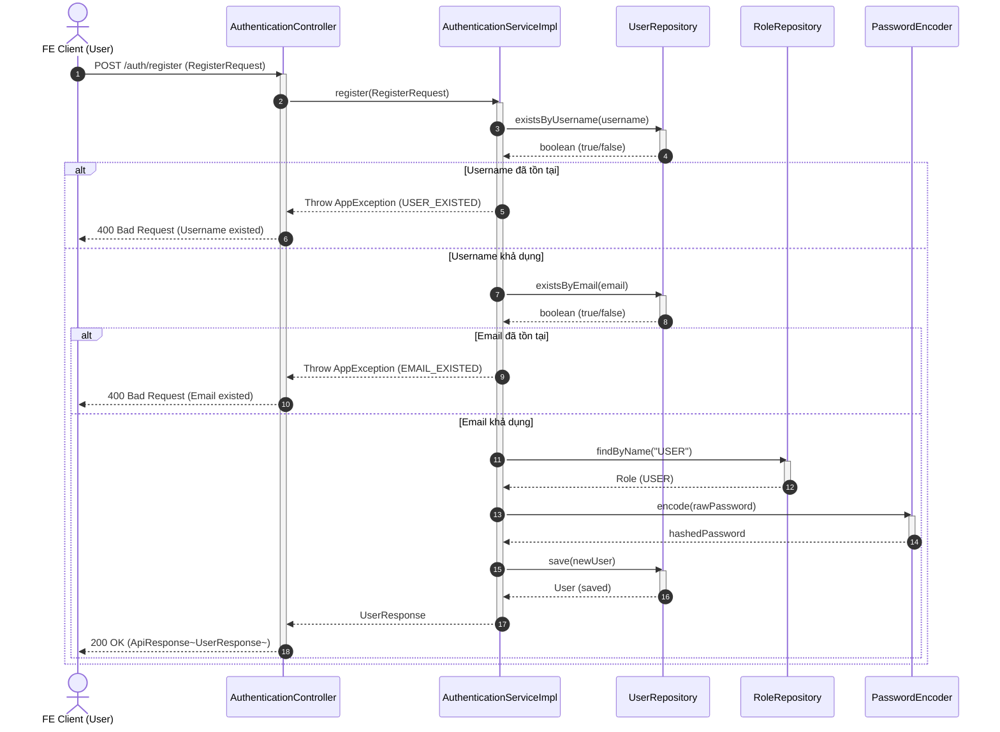
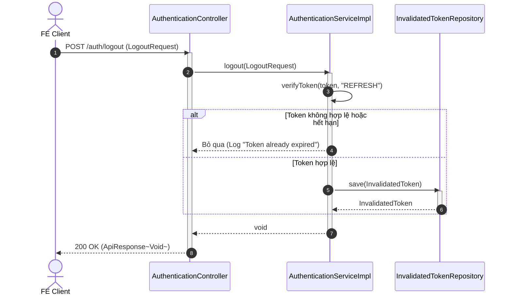
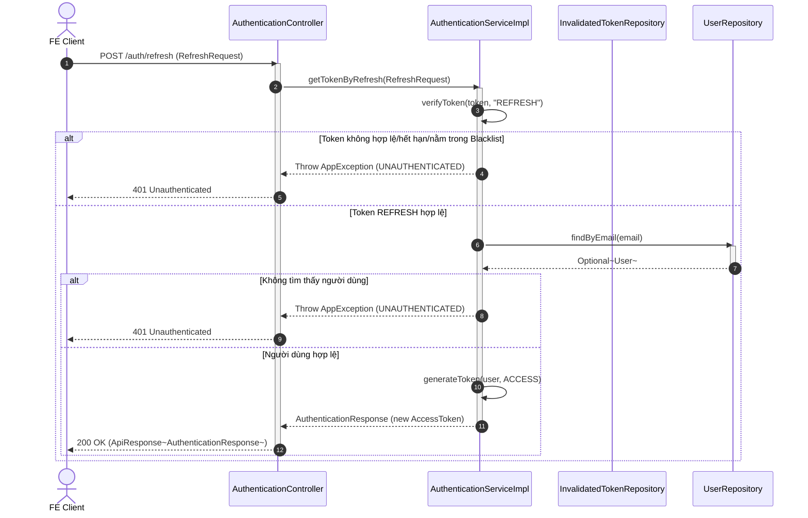
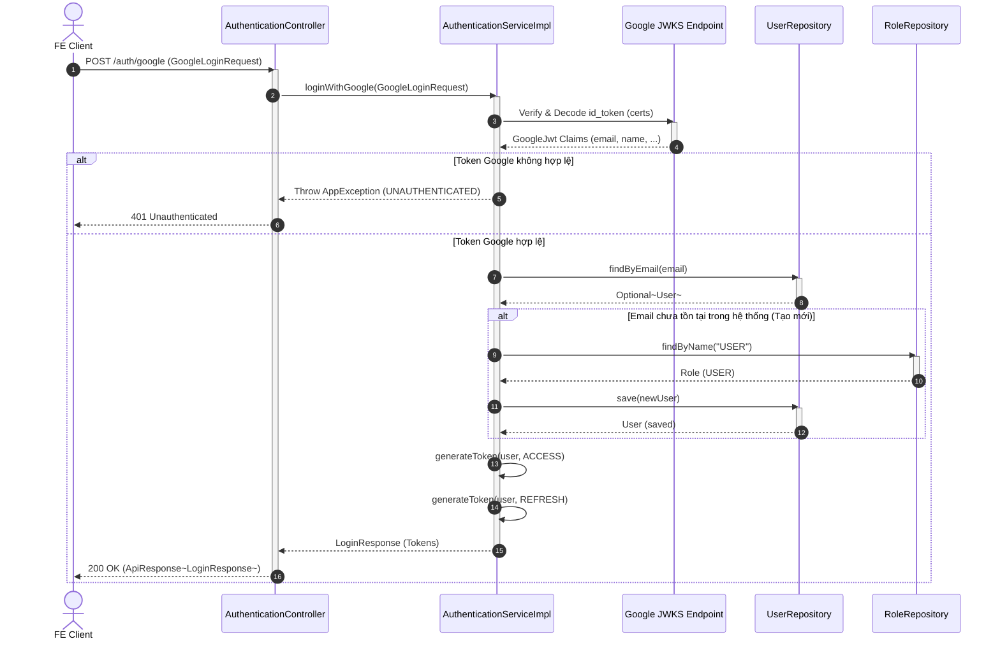

# Lược đồ Tuần tự Xác thực (Authentication Sequence Diagram) - PTIT BookLand

Tài liệu này chứa các lược đồ tuần tự (Sequence Diagram) mô tả các luồng nghiệp vụ Xác thực (Authentication) của hệ thống **PTIT BookLand** bằng cú pháp **Mermaid**.

Các luồng bao gồm:
1. **Đăng nhập hệ thống (Standard Login)**
2. **Đăng ký tài khoản (User Registration)**
3. **Đăng xuất tài khoản (Logout & Blacklist Token)**
4. **Làm mới Access Token (Token Refresh)**
5. **Đăng nhập qua Google (Google Login)**

---

## 1. Đăng nhập hệ thống (Standard Login)

---

## 2. Đăng ký tài khoản (User Registration)

---

## 3. Đăng xuất tài khoản (Logout & Blacklist Token)
*Luồng này vô hiệu hóa Refresh Token của người dùng bằng cách đưa khóa nhận diện token (JTI) vào danh sách đen (Blacklist).*

---

## 4. Làm mới Access Token (Token Refresh)
*Client sử dụng Refresh Token hợp lệ để yêu cầu hệ thống cấp phát một Access Token mới ngắn hạn.*

---

## 5. Đăng nhập qua Google (Google Login OAuth2)
*FE đăng nhập Google lấy id_token rồi gửi lên BE xác thực và tự động tạo tài khoản nếu là email mới.*

