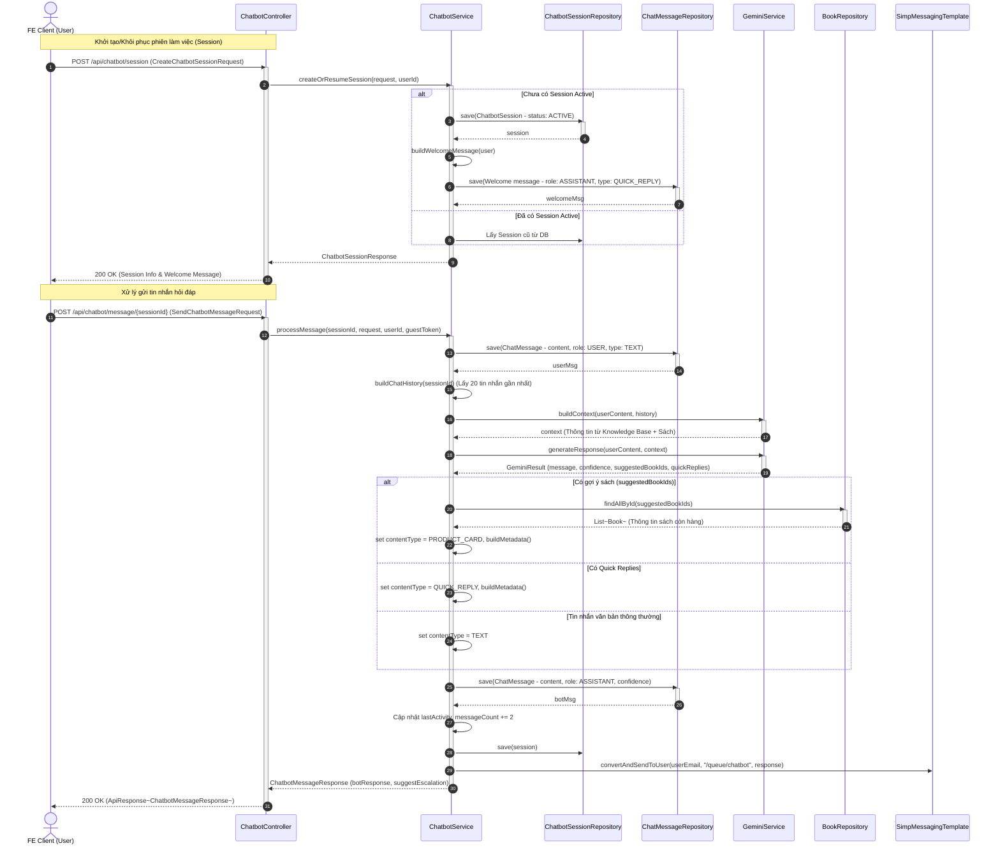
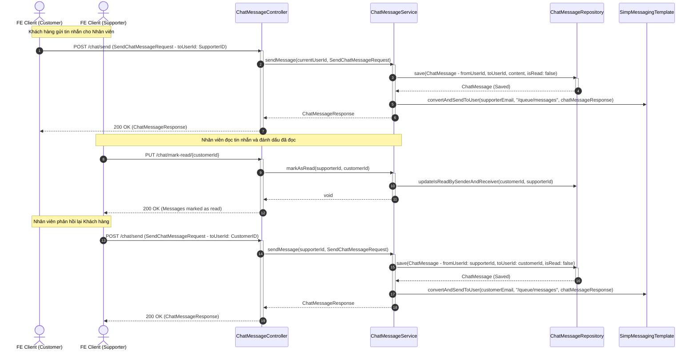

# Lược đồ Tuần tự Nghiệp vụ Chat (Chat & Chatbot Sequence Diagram) - PTIT BookLand

Tài liệu này chứa các lược đồ tuần tự (Sequence Diagram) mô tả quy trình hội thoại bao gồm: **Trò chuyện với Trợ lý AI (BookBot)** và **Hỗ trợ trực tuyến với Nhân viên hỗ trợ (Support Staff Chat)** của hệ thống **PTIT BookLand** bằng cú pháp **Mermaid**.

---

## 1. Trò chuyện với Trợ lý AI (BookBot Chatbot)
*Quy trình xử lý tin nhắn của khách hàng, tích hợp cơ sở tri thức để tạo ngữ cảnh và sử dụng Gemini API sinh phản hồi, tự động gợi ý sản phẩm hoặc yêu cầu gặp nhân viên hỗ trợ nếu độ tin cậy thấp.*

---

## 2. Hỗ trợ trực tuyến với Nhân viên hỗ trợ (Support Staff Chat)
*Quy trình trò chuyện trực tiếp (Live Chat) thời gian thực giữa Khách hàng và Nhân viên hỗ trợ qua giao thức HTTP REST kết hợp WebSocket.*

