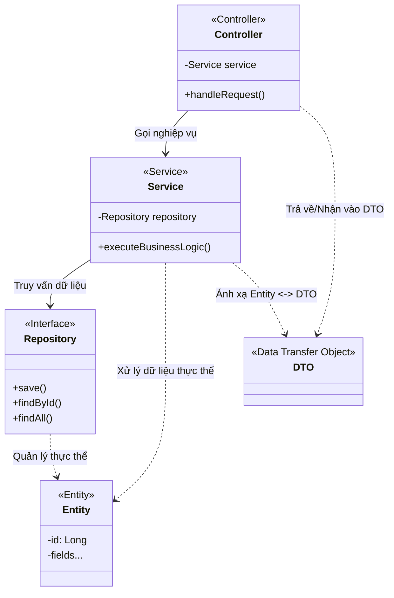
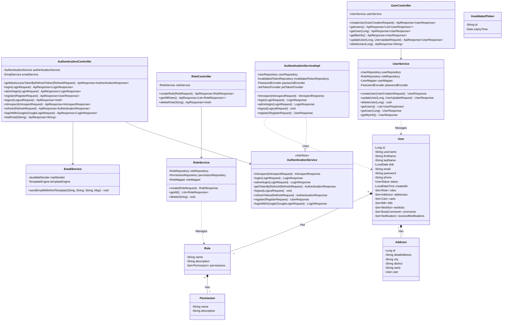
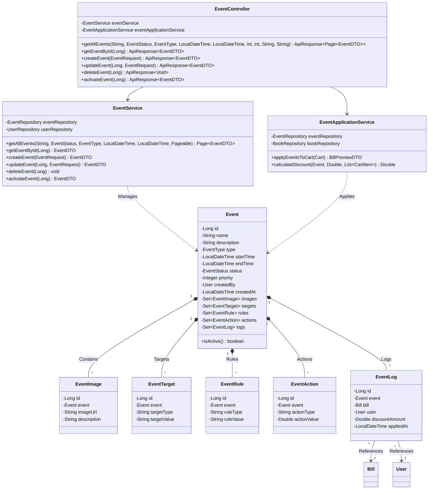

# Sơ đồ Phân lớp Backend - PTIT BookLand

Tài liệu này chứa các sơ đồ phân lớp (Class Diagram) chi tiết cho phần Backend của hệ thống **PTIT BookLand** (Spring Boot), được biểu diễn bằng cú pháp **Mermaid**.

Hệ thống được thiết kế theo kiến trúc phân lớp chuẩn:
1. **Controller Layer (Presentation)**: Tiếp nhận các yêu cầu HTTP (REST APIs), xác thực dữ liệu đầu vào và chuyển tiếp yêu cầu tới lớp Service.
2. **Service Layer (Business Logic)**: Xử lý logic nghiệp vụ, giao tiếp với các Repository và chuyển đổi giữa Entity với DTO.
3. **Repository Layer (Data Access)**: Giao tiếp với Cơ sở dữ liệu (sử dụng Spring Data JPA). *Để giữ sơ đồ tập trung, các interface Repository được thể hiện dưới dạng mối quan hệ phụ thuộc/sử dụng trong lớp Service*.
4. **Model/Entity Layer (Domain Model)**: Đại diện cho các thực thể cơ sở dữ liệu được ánh xạ bằng JPA Hibernate.

---

## 1. Kiến trúc phân lớp tổng quan (Architectural Layers Overview)
Sơ đồ dưới đây mô tả cách các lớp Controller, Service, Repository và Entity tương tác với nhau:

---

## 2. Các phân hệ chính (Core Domain Modules)

Để đảm bảo sơ đồ trực quan và dễ theo dõi, các lớp được phân chia theo 4 phân hệ chính dưới đây:

### Phân hệ 1: Người dùng & Xác thực (User & Authentication)
Quản lý người dùng, phân quyền (Role, Permission), địa chỉ (Address) và cơ chế đăng nhập (Authentication).

---

### Phân hệ 2: Danh mục & Sách (Book Catalog & Inventory)
Quản lý thông tin sách (Book), tác giả (Author), danh mục (Category), nhà xuất bản (Publisher), loạt sách (Serie) và nhà cung cấp (Supplier).

```mermaid
classDiagram
    direction TB

    %% --- CONTROLLERS ---
    class BookController {
        -BookService bookService
        +getAllBooks(String, Long, Long, Long, Long, Double, Double, int, int, String, String) ApiResponse~PageResponse~BookDTO~~
        +getBookById(Long) ApiResponse~BookDTO~
        +createBook(BookRequest) ApiResponse~BookDTO~
        +updateBook(Long, BookRequest) ApiResponse~BookDTO~
        +deleteBook(Long) ApiResponse~Void~
    }

    class BookSearchController {
        -BookService bookService
        +searchBooks(String, String, Double, Double, int, int) ApiResponse~PageResponse~BookDTO~~
        +suggestSearch(String) ApiResponse~List~String~~
    }

    class AuthorController {
        -AuthorService authorService
        +getAllAuthors(String, int, int, String, String) ApiResponse~PageResponse~AuthorDTO~~
        +getAuthorById(Long) ApiResponse~AuthorDTO~
        +createAuthor(AuthorRequest) ApiResponse~AuthorDTO~
        +updateAuthor(Long, AuthorRequest) ApiResponse~AuthorDTO~
        +deleteAuthor(Long) ApiResponse~Void~
    }

    class CategoryController {
        -CategoryService categoryService
        +getAllCategories(String, int, int, String, String) ApiResponse~PageResponse~CategoryDTO~
        +getCategoryById(Long) ApiResponse~CategoryDTO~
        +createCategory(CategoryRequest) ApiResponse~CategoryDTO~
        +updateCategory(Long, CategoryRequest) ApiResponse~CategoryDTO~
        +deleteCategory(Long) ApiResponse~Void~
    }

    class PublisherController {
        -PublisherService publisherService
        +getAllPublishers(String, int, int, String, String) ApiResponse~PageResponse~PublisherDTO~
        +getPublisherById(Long) ApiResponse~PublisherDTO~
        +createPublisher(PublisherRequest) ApiResponse~PublisherDTO~
        +updatePublisher(Long, PublisherRequest) ApiResponse~PublisherDTO~
        +deletePublisher(Long) ApiResponse~Void~
    }

    class SerieController {
        -SerieService serieService
        +getAllSeries(String, int, int, String, String) ApiResponse~PageResponse~SerieDTO~
        +getSerieById(Long) ApiResponse~SerieDTO~
        +createSerie(SerieRequest) ApiResponse~SerieDTO~
        +updateSerie(Long, SerieRequest) ApiResponse~SerieDTO~
        +deleteSerie(Long) ApiResponse~Void~
    }

    class SupplierController {
        -SupplierService supplierService
        +getAllSuppliers(String, int, int, String, String) ApiResponse~PageResponse~SupplierDTO~
        +getSupplierById(Long) ApiResponse~SupplierDTO~
        +createSupplier(SupplierRequest) ApiResponse~SupplierDTO~
        +updateSupplier(Long, SupplierRequest) ApiResponse~SupplierDTO~
        +deleteSupplier(Long) ApiResponse~Void~
    }

    %% --- SERVICES ---
    class BookService {
        -BookRepository bookRepository
        -AuthorRepository authorRepository
        -PublisherRepository publisherRepository
        -CategoryRepository categoryRepository
        -SerieRepository serieRepository
        +getAllBooks(Specification, Pageable) PageResponse~BookDTO~
        +getBookById(Long) BookDTO
        +createBook(BookRequest) BookDTO
        +updateBook(Long, BookRequest) BookDTO
        +deleteBook(Long) void
    }

    class AuthorService {
        -AuthorRepository authorRepository
        +getAllAuthors(String, Pageable) PageResponse~AuthorDTO~
        +getAuthorById(Long) AuthorDTO
        +createAuthor(AuthorRequest) AuthorDTO
        +updateAuthor(Long, AuthorRequest) AuthorDTO
        +deleteAuthor(Long) void
    }

    class CategoryService {
        -CategoryRepository categoryRepository
        +getAllCategories(String, Pageable) PageResponse~CategoryDTO~
        +getCategoryById(Long) CategoryDTO
        +createCategory(CategoryRequest) CategoryDTO
        +updateCategory(Long, CategoryRequest) CategoryDTO
        +deleteCategory(Long) void
    }

    class PublisherService {
        -PublisherRepository publisherRepository
        +getAllPublishers(String, Pageable) PageResponse~PublisherDTO~
        +getPublisherById(Long) PublisherDTO
        +createPublisher(PublisherRequest) PublisherDTO
        +updatePublisher(Long, PublisherRequest) PublisherDTO
        +deletePublisher(Long) void
    }

    class SerieService {
        -SerieRepository serieRepository
        +getAllSeries(String, Pageable) PageResponse~SerieDTO~
        +getSerieById(Long) SerieDTO
        +createSerie(SerieRequest) SerieDTO
        +updateSerie(Long, SerieRequest) SerieDTO
        +deleteSerie(Long) void
    }

    class SupplierService {
        -SupplierRepository supplierRepository
        +getAllSuppliers(String, Pageable) PageResponse~SupplierDTO~
        +getSupplierById(Long) SupplierDTO
        +createSupplier(SupplierRequest) SupplierDTO
        +updateSupplier(Long, SupplierRequest) SupplierDTO
        +deleteSupplier(Long) void
    }

    %% --- ENTITIES ---
    class Book {
        -Long id
        -String name
        -String description
        -Double originalCost
        -Double sale
        -Integer stock
        -BookStatus status
        -LocalDate publishedDate
        -String bookImageUrl
        -Boolean pin
        -Author author
        -Publisher publisher
        -Serie series
        -User creator
        -Set~Category~ categories
        +getFinalPrice() Double
    }

    class Author {
        -Long id
        -String name
        -String description
        -String authorImage
        -Set~Book~ books
    }

    class Category {
        -Long id
        -String name
        -String description
        -Set~Book~ books
    }

    class Publisher {
        -Long id
        -String name
        -String address
        -String phone
        -String email
        -Set~Book~ books
    }

    class Serie {
        -Long id
        -String name
        -String description
        -Set~Book~ books
    }

    class Supplier {
        -Long id
        -String name
        -String address
        -String phone
        -String email
    }

    %% --- RELATIONSHIPS ---
    BookController --> BookService
    BookSearchController --> BookService
    AuthorController --> AuthorService
    CategoryController --> CategoryService
    PublisherController --> PublisherService
    SerieController --> SerieService
    SupplierController --> SupplierService

    BookService ..> Book : Manages
    AuthorService ..> Author : Manages
    CategoryService ..> Category : Manages
    PublisherService ..> Publisher : Manages
    SerieService ..> Serie : Manages
    SupplierService ..> Supplier : Manages

    Book "*" --> "1" Author : Written by
    Book "*" --> "1" Publisher : Published by
    Book "*" --> "0..1" Serie : Part of
    Book "m" *-- "n" Category : Classified in
```

---

### Phân hệ 3: Giỏ hàng, Đơn hàng & Thanh toán (Cart, Order & Payment)
Quản lý giỏ hàng tạm thời (Cart, CartItem), quy trình tạo đơn hàng (Bill, BillBook), tích hợp thanh toán (PaymentMethod, PaymentTransaction) và phương thức vận chuyển (ShippingMethod).

```mermaid
classDiagram
    direction TB

    %% --- CONTROLLERS ---
    class CartController {
        -CartService cartService
        +getCart() ApiResponse~CartDTO~
        +addToCart(AddToCartRequest) ApiResponse~CartDTO~
        +updateCartItem(Long, UpdateCartItemRequest) ApiResponse~CartDTO~
        +removeFromCart(Long) ApiResponse~CartDTO~
        +clearCart() ApiResponse~Void~
    }

    class BillController {
        -BillService billService
        -BillPreviewService billPreviewService
        +getAllBills(Long, BillStatus, LocalDateTime, LocalDateTime, Double, Double, int, int, String, String) ApiResponse~Page~BillDTO~~
        +getOwnBills(BillStatus, LocalDateTime, LocalDateTime, Double, Double, int, int, String, String) ApiResponse~Page~BillDTO~~
        +getBillById(Long) ApiResponse~BillDTO~
        +previewBill(PreviewBillRequest) ApiResponse~BillPreviewDTO~
        +createBill(CreateBillRequest) ApiResponse~BillDTO~
        +updateBillStatus(Long, UpdateBillStatusRequest) ApiResponse~BillDTO~
        +confirmDelivered(Long) ApiResponse~BillDTO~
        +getShippingBills(int, int, String, String) ApiResponse~Page~BillDTO~~
        +deleteBill(Long) ApiResponse~Void~
    }

    class PaymentController {
        -BillService billService
        -PaymentMethodService paymentMethodService
        +createPaymentUrl(Long, HttpServletRequest) ApiResponse~String~
        +vnpayCallback(HttpServletRequest) ApiResponse~PaymentTransactionDTO~
    }

    class PaymentMethodController {
        -PaymentMethodService paymentMethodService
        +getAllPaymentMethods() ApiResponse~List~PaymentMethodDTO~~
        +getPaymentMethodById(Long) ApiResponse~PaymentMethodDTO~
        +createPaymentMethod(PaymentMethodRequest) ApiResponse~PaymentMethodDTO~
        +updatePaymentMethod(Long, PaymentMethodRequest) ApiResponse~PaymentMethodDTO~
    }

    class ShippingMethodController {
        -ShippingMethodService shippingMethodService
        +getAllShippingMethods() ApiResponse~List~ShippingMethodDTO~~
        +getShippingMethodById(Long) ApiResponse~ShippingMethodDTO~
    }

    %% --- SERVICES ---
    class CartService {
        -CartRepository cartRepository
        -CartItemRepository cartItemRepository
        -BookRepository bookRepository
        -UserRepository userRepository
        +getOrCreateCart(String) Cart
        +addToCart(String, AddToCartRequest) CartDTO
        +updateCartItem(String, Long, UpdateCartItemRequest) CartDTO
        +removeFromCart(String, Long) CartDTO
        +clearCart(String) void
    }

    class BillService {
        -BillRepository billRepository
        -UserRepository userRepository
        -CartRepository cartRepository
        -PaymentMethodRepository paymentMethodRepository
        -ShippingMethodRepository shippingMethodRepository
        -BookRepository bookRepository
        +createBill(CreateBillRequest) BillDTO
        +getBillById(Long) BillDTO
        +getAllBills(Long, BillStatus, LocalDateTime, LocalDateTime, Double, Double, Pageable) Page~BillDTO~
        +getOwnBills(String, BillStatus, LocalDateTime, LocalDateTime, Double, Double, Pageable) Page~BillDTO~
        +updateBillStatus(Long, UpdateBillStatusRequest) BillDTO
        +confirmDelivered(Long, String) BillDTO
    }

    class BillPreviewService {
        -CartRepository cartRepository
        -ShippingMethodRepository shippingMethodRepository
        -EventService eventService
        +previewBill(PreviewBillRequest) BillPreviewDTO
    }

    class PaymentMethodService {
        -PaymentMethodRepository paymentMethodRepository
        +getAllPaymentMethods() List~PaymentMethodDTO~
        +getPaymentMethodById(Long) PaymentMethodDTO
        +createPaymentMethod(PaymentMethodRequest) PaymentMethodDTO
        +updatePaymentMethod(Long, PaymentMethodRequest) PaymentMethodDTO
    }

    class ShippingMethodService {
        -ShippingMethodRepository shippingMethodRepository
        +getAllShippingMethods() List~ShippingMethodDTO~
        +getShippingMethodById(Long) ShippingMethodDTO
    }

    %% --- ENTITIES ---
    class Cart {
        -Long id
        -Long version
        -User user
        -CartStatus status
        -LocalDateTime createdAt
        -LocalDateTime updatedAt
        -Set~CartItem~ items
    }

    class CartItem {
        -Long id
        -Cart cart
        -Book book
        -Integer quantity
        -LocalDateTime createdAt
    }

    class Bill {
        -Long id
        -User user
        -PaymentMethod paymentMethod
        -ShippingMethod shippingMethod
        -Double totalCost
        -User approvedBy
        -BillStatus status
        -String paymentStatus
        -LocalDateTime createdAt
        -LocalDateTime approvedAt
        -Set~BillBook~ billBooks
        -Set~PaymentTransaction~ transactions
        -Set~EventLog~ eventLogs
    }

    class BillBook {
        -Long id
        -Bill bill
        -Book book
        -Integer quantity
        -Double price
    }

    class PaymentMethod {
        -Long id
        -String name
        -String description
        -Boolean status
    }

    class PaymentTransaction {
        -Long id
        -Bill bill
        -String transactionNo
        -Double amount
        -String bankCode
        -String cardType
        -String orderInfo
        -LocalDateTime payDate
        -String responseCode
    }

    class ShippingMethod {
        -Long id
        -String name
        -Double cost
        -String description
    }

    %% --- RELATIONSHIPS ---
    CartController --> CartService
    BillController --> BillService
    BillController --> BillPreviewService
    PaymentController --> BillService
    PaymentController --> PaymentMethodService
    PaymentMethodController --> PaymentMethodService
    ShippingMethodController --> ShippingMethodService

    CartService ..> Cart : Manages
    BillService ..> Bill : Manages
    BillPreviewService ..> Bill : Previews

    Cart "1" *-- "*" CartItem : Contains
    CartItem "*" --> "1" Book : References
    Cart "*" --> "1" User : Belongs to

    Bill "1" *-- "*" BillBook : Contains
    BillBook "*" --> "1" Book : References
    Bill "*" --> "1" User : Ordered by
    Bill "*" --> "1" PaymentMethod : Paid via
    Bill "*" --> "1" ShippingMethod : Shipped via
    Bill "1" *-- "*" PaymentTransaction : Tracks
```

---

### Phân hệ 4: Tương tác, Đánh giá & Chatbot AI (Interactions, Feedbacks & AI Chat)
Hỗ trợ tương tác của khách hàng như bình luận đánh giá sách (BookComment), danh sách yêu thích (Wishlist), hệ thống thông báo (Notification) và trợ lý ảo thông minh tích hợp AI (ChatMessage, ChatbotSession, ChatbotKnowledge, Gemini Service).

```mermaid
classDiagram
    direction TB

    %% --- CONTROLLERS ---
    class BookCommentController {
        -BookCommentService bookCommentService
        +getCommentsByBookId(Long, int, int) ApiResponse~PageResponse~BookCommentDTO~~
        +createComment(BookCommentRequest) ApiResponse~BookCommentDTO~
        +deleteComment(Long) ApiResponse~Void~
    }

    class WishlistController {
        -WishlistService wishlistService
        +getWishlist() ApiResponse~List~WishlistDTO~~
        +addToWishlist(WishlistRequest) ApiResponse~WishlistDTO~
        +removeFromWishlist(Long) ApiResponse~Void~
    }

    class NotificationController {
        -NotificationService notificationService
        +getNotifications(int, int) ApiResponse~Page~NotificationDTO~~
        +markAsRead(Long) ApiResponse~NotificationDTO~
        +markAllAsRead() ApiResponse~Void~
    }

    class ChatMessageController {
        -ChatMessageService chatMessageService
        -ChatbotService chatbotService
        +getChatHistory(String) ApiResponse~List~ChatMessageDTO~~
        +sendMessage(ChatMessageRequest) ApiResponse~ChatMessageDTO~
    }

    class ChatbotController {
        -ChatbotService chatbotService
        +askChatbot(ChatbotRequest) ApiResponse~ChatbotResponse~
        +createSession() ApiResponse~ChatbotSessionDTO~
    }

    %% --- SERVICES ---
    class BookCommentService {
        -BookCommentRepository commentRepository
        -BookRepository bookRepository
        -UserRepository userRepository
        +getCommentsByBook(Long, Pageable) PageResponse~BookCommentDTO~
        +createComment(String, BookCommentRequest) BookCommentDTO
        +deleteComment(Long, String) void
    }

    class WishlistService {
        -WishlistRepository wishlistRepository
        -BookRepository bookRepository
        -UserRepository userRepository
        +getWishlistByUser(String) List~WishlistDTO~
        +addToWishlist(String, WishlistRequest) WishlistDTO
        +removeFromWishlist(String, Long) void
    }

    class NotificationService {
        -NotificationRepository notificationRepository
        -UserRepository userRepository
        +getUserNotifications(String, Pageable) Page~NotificationDTO~
        +sendNotification(User, String, String, String) Notification
        +markAsRead(Long, String) NotificationDTO
        +markAllAsRead(String) void
    }

    class ChatMessageService {
        -ChatMessageRepository chatMessageRepository
        +saveMessage(ChatMessage) ChatMessage
        +getChatHistory(String) List~ChatMessage~
    }

    class ChatbotService {
        -GeminiService geminiService
        -ChatbotKnowledgeRepository knowledgeRepository
        -ChatbotSessionRepository sessionRepository
        -AiProviderService aiProviderService
        +processUserMessage(String, String) String
        +createSession(String) ChatbotSession
    }

    class GeminiService {
        -String apiKey
        -RestTemplate restTemplate
        +generateContent(String) String
        +generateEmbedding(String) float[]
    }

    class AiProviderService {
        -List~AiProvider~ providers
        +callActiveAiProvider(String) String
    }

    %% --- ENTITIES ---
    class BookComment {
        -Long id
        -User user
        -Book book
        -Integer rating
        -String commentText
        -LocalDateTime createdAt
    }

    class Wishlist {
        -Long id
        -User user
        -Book book
        -LocalDateTime createdAt
    }

    class Notification {
        -Long id
        -User to
        -String title
        -String content
        -String type
        -Boolean isRead
        -LocalDateTime createdAt
    }

    class ChatMessage {
        -Long id
        -ChatbotSession session
        -String sender
        -String content
        -LocalDateTime timestamp
    }

    class ChatbotSession {
        -Long id
        -User user
        -String sessionToken
        -LocalDateTime createdAt
        -LocalDateTime lastActiveAt
        -Set~ChatMessage~ messages
    }

    class ChatbotKnowledge {
        -Long id
        -String question
        -String answer
        -String tags
        -List~Float~ embedding
    }

    class AiFeedback {
        -Long id
        -String userQuery
        -String aiResponse
        -Integer rating
        -String comments
    }

    class Escalation {
        -Long id
        -ChatbotSession session
        -String reason
        -String status
        -LocalDateTime escalatedAt
    }

    %% --- RELATIONSHIPS ---
    BookCommentController --> BookCommentService
    WishlistController --> WishlistService
    NotificationController --> NotificationService
    ChatMessageController --> ChatMessageService
    ChatMessageController --> ChatbotService
    ChatbotController --> ChatbotService

    BookCommentService ..> BookComment : Manages
    WishlistService ..> Wishlist : Manages
    NotificationService ..> Notification : Manages
    ChatbotService --> GeminiService
    ChatbotService --> AiProviderService

    BookComment "*" --> "1" User : Written by
    BookComment "*" --> "1" Book : Belongs to
    Wishlist "*" --> "1" User : Owned by
    Wishlist "*" --> "1" Book : Likes
    Notification "*" --> "1" User : Sent to
    ChatMessage "*" --> "1" ChatbotSession : Part of
    ChatbotSession "*" --> "1" User : Belongs to
    Escalation "*" --> "1" ChatbotSession : Escalated from
```

---

### Phân hệ 5: Khuyến mãi & Sự kiện (Events & Promotions)
Quản lý các chương trình khuyến mãi (Event), bao gồm đối tượng áp dụng (EventTarget), điều kiện áp dụng (EventRule), hành động giảm giá (EventAction) và lịch sử áp dụng (EventLog).

