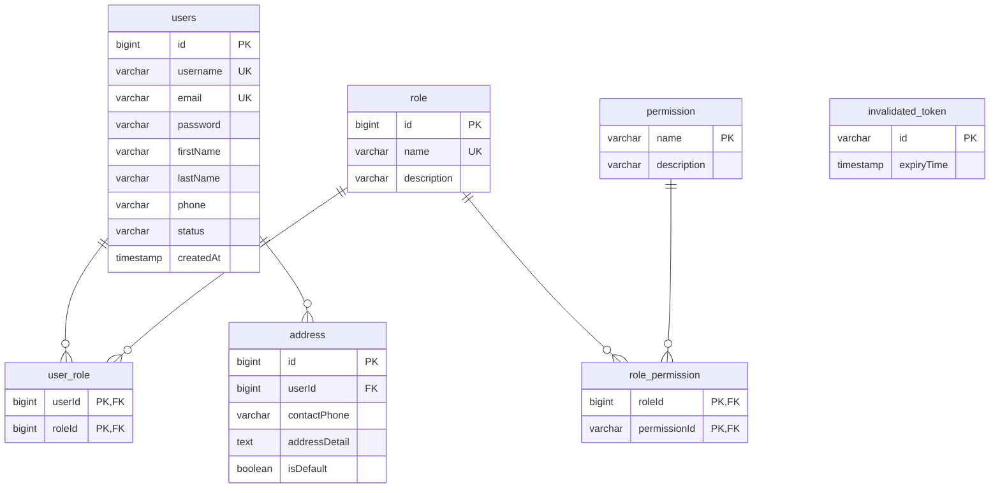
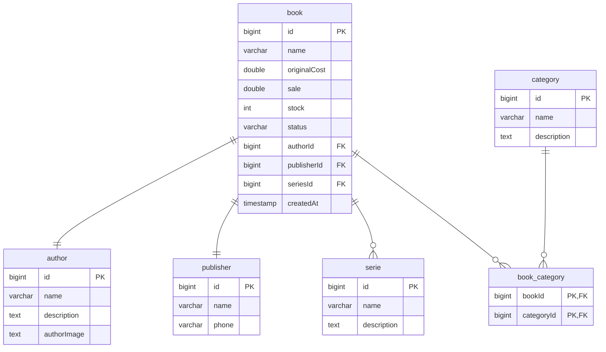
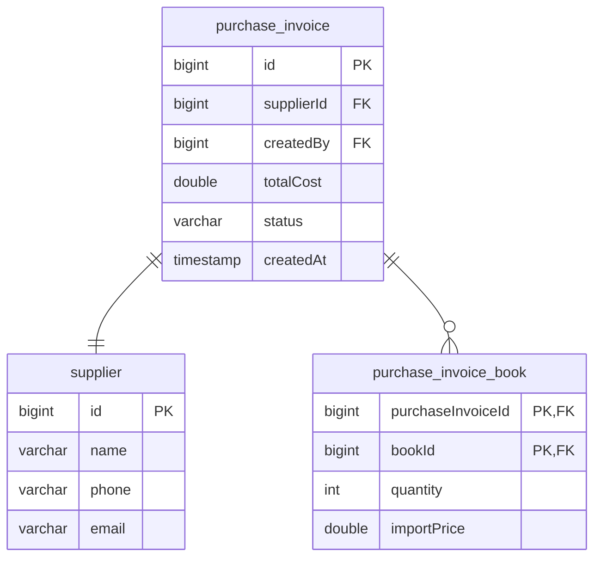
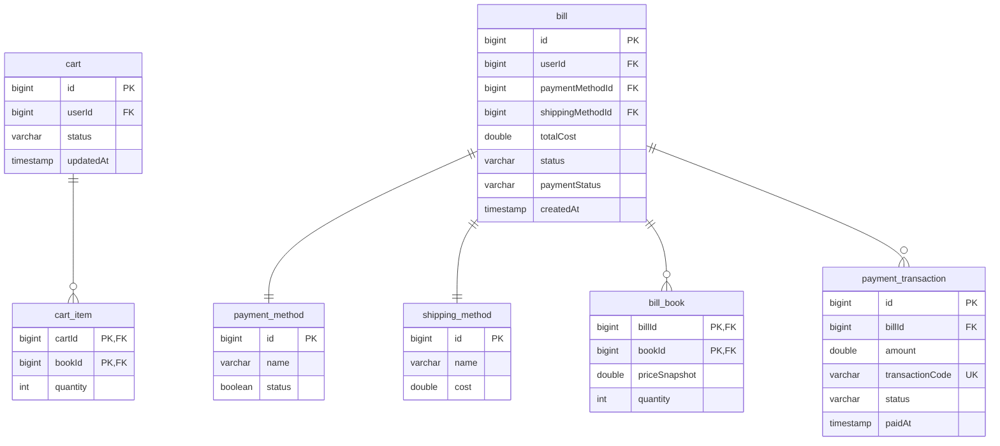
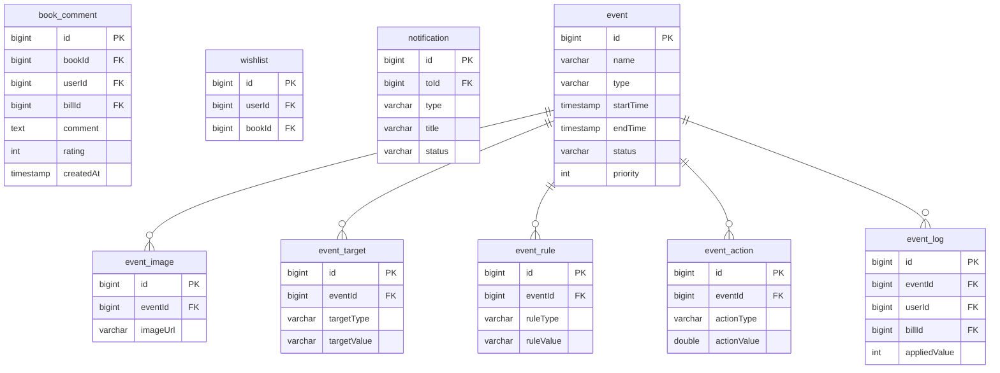
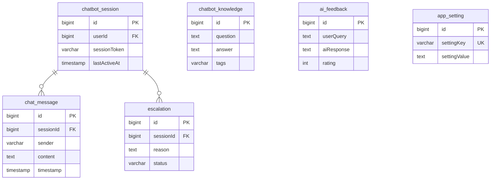

# Lược đồ Cơ sơ dữ liệu (Database Schema) - PTIT BookLand

Tài liệu này chứa lược đồ Cơ sở dữ liệu (ER Diagram) được tinh chỉnh gọn gàng, chia thành sơ đồ tổng quan rút gọn và các phân hệ chi tiết để dễ dàng theo dõi.

---

## 1. Sơ đồ Quan hệ Tổng quan (High-Level ERD)
*Sơ đồ rút gọn thể hiện các mối quan hệ liên kết giữa các bảng trong hệ thống (không bao gồm chi tiết cột để tránh rối mắt).*

```mermaid
erDiagram
    %% --- USER & SECURITY ---
    users ||--o{ address : "has"
    users ||--o{ user_role : "has"
    role ||--o{ user_role : "has"
    role ||--o{ role_permission : "has"
    permission ||--o{ role_permission : "has"

    %% --- CATALOG & SUPPLY ---
    book ||--|| author : "written_by"
    book ||--|| publisher : "published_by"
    book ||--o{ serie : "belongs_to"
    book ||--o{ book_category : "has"
    category ||--o{ book_category : "has"
    book ||--o{ users : "created_by"
    purchase_invoice ||--|| supplier : "supplied_by"
    purchase_invoice ||--|| users : "created_by"
    purchase_invoice ||--o{ purchase_invoice_book : "contains"
    book ||--o{ purchase_invoice_book : "contains"

    %% --- CART & CHECKOUT Flow ---
    cart ||--|| users : "owned_by"
    cart ||--o{ cart_item : "contains"
    book ||--o{ cart_item : "contains"
    bill ||--|| users : "placed_by"
    bill ||--|| payment_method : "paid_with"
    bill ||--|| shipping_method : "shipped_with"
    bill ||--o{ bill_book : "contains"
    book ||--o{ bill_book : "contains"
    bill ||--o{ payment_transaction : "has"
    payment_method ||--o{ payment_transaction : "has"

    %% --- INTERACTIONS & PROMOTIONS ---
    book_comment ||--|| book : "about"
    book_comment ||--|| users : "by"
    book_comment ||--|| bill : "verified_purchase"
    wishlist ||--|| users : "by"
    wishlist ||--|| book : "contains"
    notification ||--o{ users : "sent_to"
    event ||--|| users : "created_by"
    event ||--o{ event_image : "has"
    event ||--o{ event_target : "applies_to"
    event ||--o{ event_rule : "requires"
    event ||--o{ event_action : "triggers"
    event ||--o{ event_log : "records"
    event_log ||--|| users : "by"
    event_log ||--|| bill : "applied_to"

    %% --- CHATBOT AI ---
    chatbot_session ||--|| users : "by"
    chat_message ||--|| chatbot_session : "contains"
    escalation ||--|| chatbot_session : "triggers"
```

---

## 2. Chi tiết theo Phân hệ (Detailed Schema by Modules)

### 2.1 Phân hệ Người dùng & Phân quyền (User & Security)

### 2.2 Phân hệ Sách & Danh mục (Catalog & Inventory)

### 2.3 Phân hệ Nhập hàng & Nhà cung cấp (Supply Chain)

### 2.4 Phân hệ Giỏ hàng & Thanh toán (Cart & Checkout Flow)

### 2.5 Phân hệ Tương tác & Khuyến mãi (Interactions & Events)

### 2.6 Trợ lý Chatbot AI & Cấu hình hệ thống (AI & Configurations)

