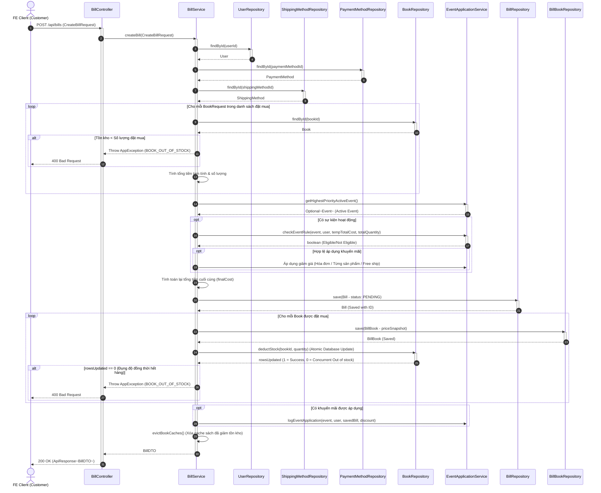
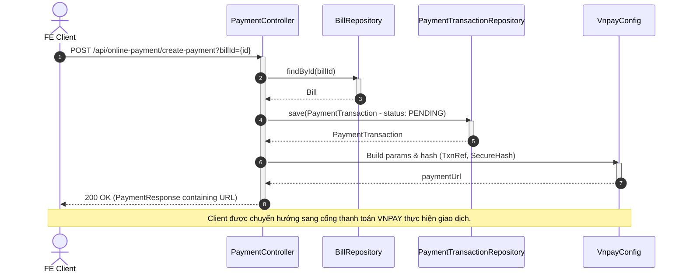
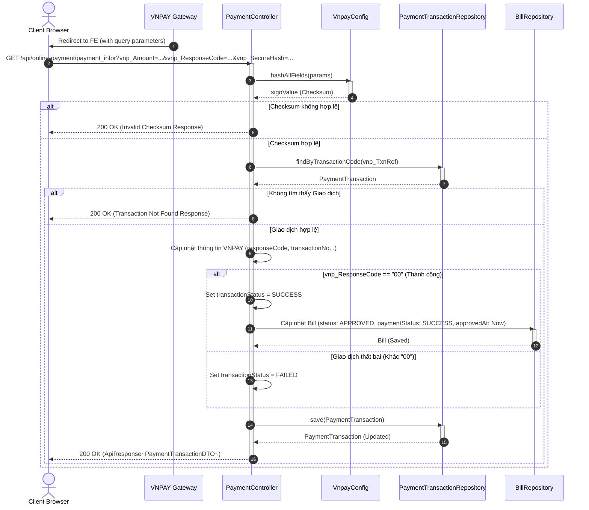
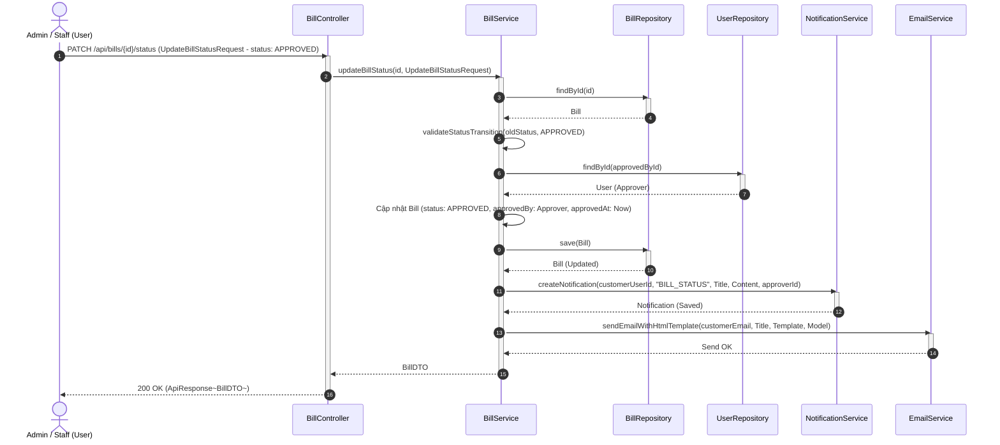

# Lược đồ Tuần tự Nghiệp vụ Đơn hàng (Order Workflow Sequence Diagram) - PTIT BookLand

Tài liệu này chứa các lược đồ tuần tự (Sequence Diagram) mô tả quy trình nghiệp vụ Đơn hàng bao gồm: **Tạo hóa đơn**, **Thanh toán trực tuyến (VNPAY)**, và **Duyệt đơn hàng** của hệ thống **PTIT BookLand** bằng cú pháp **Mermaid**.

---

## 1. Tạo hóa đơn (Create Bill)
*Mô tả quy trình khách hàng tiến hành đặt hàng từ giỏ hàng, áp dụng chương trình khuyến mãi tự động (nếu hợp lệ) và khấu trừ tồn kho sách.*

---

## 2. Thanh toán trực tuyến (VNPAY Online Payment)
*Quy trình tạo URL thanh toán dẫn sang cổng sandbox VNPAY và xử lý callback nhận kết quả thanh toán từ VNPAY để cập nhật trạng thái hóa đơn tự động.*

### 2.1 Yêu cầu tạo URL thanh toán (Create Payment URL)

### 2.2 Xử lý Callback kết quả thanh toán (Handle VNPAY Callback)

---

## 3. Duyệt đơn hàng (Approve Bill)
*Nhân viên vận hành (Admin/Manager/Order Staff) phê duyệt đơn hàng thủ công (ví dụ đối với các đơn hàng thanh toán khi nhận hàng - COD hoặc xử lý sự cố).*

