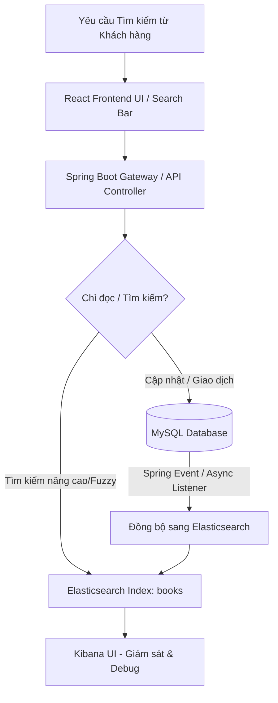

# 🔎 Nghiên Cứu & Hướng Dẫn Tích Hợp Tìm Kiếm Với Elasticsearch trong BookLand

Tài liệu này được biên soạn nhằm hướng dẫn chi tiết từ lý thuyết nghiên cứu đến mã nguồn thực tế để triển khai công nghệ **Elasticsearch (ES)** làm công cụ tìm kiếm chính cho hệ thống cửa hàng sách **BookLand** (Spring Boot 3.5.x + React + MySQL + Redis).

---

## 📌 BẢN ĐỒ LỘ TRÌNH TRIỂN KHAI


---

## 1. 💡 Tại Sao Nên Dùng Elasticsearch Cho BookLand?

Trong các hệ thống thương mại điện tử như BookLand, **Tìm kiếm** là tính năng có tần suất sử dụng cao nhất và trực tiếp ảnh hưởng đến doanh số bán sách.

### 📊 So sánh chi tiết: MySQL `LIKE` vs Elasticsearch

| Tính năng | MySQL `LIKE %query%` | Elasticsearch (ES) |
| :--- | :--- | :--- |
| **Tốc độ truy vấn** | **Chậm.** Thực hiện Full Table Scan khi có ký tự `%` ở đầu. Càng nhiều dữ liệu càng chậm. | **Cực nhanh (Miliseconds).** Sử dụng cấu trúc dữ liệu **Inverted Index** (chỉ mục đảo). |
| **Tìm kiếm mờ (Fuzzy Search)** | **Không hỗ trợ.** Gõ sai một chữ (ví dụ: *Sherlock Holmes* thành *Sherlok Holmes*) sẽ không ra kết quả. | **Hỗ trợ mạnh mẽ.** Sử dụng thuật toán khoảng cách Levenshtein để sửa lỗi chính tả tự động. |
| **Độ chính xác & Trọng số** | **Kém.** Kết quả trả về không được sắp xếp theo độ liên quan thực tế của từ khóa. | **Tuyệt vời.** Sắp xếp theo thuật toán **BM25** (tần suất từ khóa xuất hiện, độ dài văn bản) và tùy chỉnh trọng số (Boost). |
| **Phân tích ngôn ngữ** | **Thô sơ.** Chỉ so khớp chuỗi cơ bản. | **Thông minh.** Hỗ trợ tách từ (tokenization), bỏ dấu tiếng Việt, tìm kiếm đồng nghĩa (synonyms). |
| **Bộ lọc Đa năng (Faceted Search)** | **Rất phức tạp.** Cần viết các truy vấn `GROUP BY` lồng nhau rất nặng để lấy số lượng sản phẩm theo từng danh mục. | **Cực đơn giản & Hiệu năng cao.** Hỗ trợ cơ chế **Aggregations** tính toán thời gian thực cực nhanh. |

---

## 2. 🏗️ Thiết Kế Kiến Trúc Đồng Bộ Dữ Liệu

Để đảm bảo hiệu năng và tính toàn vẹn dữ liệu, hệ thống BookLand sẽ áp dụng mô hình **CQRS (Command Query Responsibility Segregation)** thu nhỏ:
* **Write Model (Single Source of Truth):** **MySQL** xử lý các tác vụ thêm/sửa/xóa sách, quản lý giỏ hàng, hóa đơn.
* **Read Model (Search-Optimized):** **Elasticsearch** xử lý riêng cho nghiệp vụ tìm kiếm sách, lọc và phân trang.

### Các chiến lược đồng bộ dữ liệu phổ biến:
1. **Spring Application Events (Bất đồng bộ - Khuyên Dùng):**
   * *Cơ chế:* Khi Backend xử lý thêm/sửa/xóa sách thành công trong DB, nó sẽ phát đi một **Spring Event**. Một **Async Listener** sẽ bắt event này và gửi request cập nhật sang Elasticsearch.
   * *Ưu điểm:* Rất dễ triển khai, chạy ngay trong ứng dụng Spring Boot, cập nhật gần như thời gian thực (Near Real-Time), không tốn chi phí hạ tầng.
2. **Logstash JDBC Input plugin:**
   * *Cơ chế:* Logstash chạy ngầm, quét bảng `book` trong MySQL định kỳ (ví dụ 5 giây/lần) dựa trên cột `updated_at` để kéo dữ liệu mới sang ES.
   * *Ưu điểm:* Tách biệt logic hoàn toàn khỏi ứng dụng Java.
   * *Nhược điểm:* Độ trễ cao hơn, khó xử lý trường hợp bản ghi bị xóa (Hard Delete).
3. **CDC (Change Data Capture) - Debezium + Kafka:**
   * *Cơ chế:* Lắng nghe Binlog của MySQL để đồng bộ tự động từng thay đổi nhỏ nhất sang ES.
   * *Ưu điểm:* Tuyệt đối an toàn, chịu tải cực lớn.
   * *Nhược điểm:* Hạ tầng quá phức tạp và đắt đỏ cho quy mô dự án hiện tại.

> [!TIP]
> **Quyết định:** Dự án BookLand sẽ sử dụng **Spring Application Events** kết hợp `@Async` để đồng bộ dữ liệu. Đây là giải pháp tối ưu nhất: vừa đảm bảo code sạch, vừa đạt hiệu năng cao mà không làm tăng độ phức tạp hạ tầng.

---

## 3. 🐳 Cấu Hìn Docker Compose Cho Elasticsearch & Kibana

Hãy cập nhật file `docker-compose.yml` ở thư mục gốc của dự án để bổ sung cụm Elasticsearch và công cụ quản trị Kibana.

### 📝 Đoạn cấu hình thêm vào `docker-compose.yml`:

```yaml
  # 5. Elasticsearch
  bookland-elasticsearch:
    image: docker.elastic.co/elasticsearch/elasticsearch:8.11.1
    container_name: bookland-elasticsearch
    restart: always
    environment:
      - node.name=bookland-es-node
      - discovery.type=single-node
      - bootstrap.memory_lock=true
      - "ES_JAVA_OPTS=-Xms512m -Xmx512m" # Giới hạn RAM tối đa 512MB tránh tràn RAM VPS
      - xpack.security.enabled=false     # Tắt security ở môi trường local/dev để cấu hình đơn giản
    ports:
      - "9200:9200"
    ulimits:
      memlock:
        soft: -1
        hard: -1
    volumes:
      - es_data:/usr/share/elasticsearch/data

  # 6. Kibana (Giao diện trực quan hóa và debug truy vấn)
  bookland-kibana:
    image: docker.elastic.co/kibana/kibana:8.11.1
    container_name: bookland-kibana
    restart: always
    ports:
      - "5601:5601"
    environment:
      - ELASTICSEARCH_HOSTS=http://bookland-elasticsearch:9200
    depends_on:
      - bookland-elasticsearch

volumes:
  mysql_data:
  es_data: # Volume lưu trữ dữ liệu Elasticsearch không bị mất khi restart container
```

---

## 4. 🛠️ Tích Hợp Vào Dự Án Backend Spring Boot

### 🔌 Bước 4.1: Thêm Dependency Vào `build.gradle`

Mở file `BookLand_BE/build.gradle` và thêm dependency của Spring Data Elasticsearch vào phần `dependencies`:

```groovy
    /* ================= SEARCH ENGINE ================= */
    // Spring Data Elasticsearch tương thích với Spring Boot 3.5.x
    implementation 'org.springframework.boot:spring-boot-starter-data-elasticsearch'
```

### ⚙️ Bước 4.2: Cập Nhật Cấu Cấu Hình Kết Nối (`.env` & `application.properties`)

1. Thêm biến môi trường vào `BookLand_BE/.env`:
```properties
# Elasticsearch Configuration
ELASTICSEARCH_URIS=http://localhost:9200
```
*(Nếu chạy bằng Docker Compose cho toàn bộ hệ thống, biến này trên server sẽ được đổi thành `http://bookland-elasticsearch:9200`)*.

2. Cập nhật `BookLand_BE/src/main/resources/application.properties`:
```properties
# ================= ELASTICSEARCH =================
spring.elasticsearch.uris=${ELASTICSEARCH_URIS}
# Tắt chế độ tự tạo index tự động nếu muốn kiểm soát schema chặt chẽ (hoặc bật true để tự tạo khi start app)
spring.elasticsearch.connection-timeout=5s
spring.elasticsearch.socket-timeout=30s
```

---

### 📂 Bước 4.3: Viết Mã Nguồn Chi Tiết Theo Gói Cấu Trúc

Chúng ta sẽ hoàn thiện mã nguồn trong thư mục `com.example.bookland_be.elasticsearch`.

```
com.example.bookland_be.elasticsearch/
├── document/
│   └── BookDocument.java
├── repository/
│   └── BookElasticsearchRepository.java
├── service/
│   └── BookSearchService.java
└── component/
    └── BookSyncEventListener.java
```

#### 1️⃣ Tạo Document Mapping: `BookDocument.java`
*Đường dẫn lưu file:* `BookLand_BE/src/main/java/com/example/bookland_be/elasticsearch/document/BookDocument.java`

```java
package com.example.bookland_be.elasticsearch.document;

import lombok.*;
import org.springframework.data.annotation.Id;
import org.springframework.data.elasticsearch.annotations.Document;
import org.springframework.data.elasticsearch.annotations.Field;
import org.springframework.data.elasticsearch.annotations.FieldType;
import org.springframework.data.elasticsearch.annotations.Setting;

import java.time.LocalDateTime;
import java.util.Set;

@Getter
@Setter
@NoArgsConstructor
@AllArgsConstructor
@Builder
@Document(indexName = "books")
// Cấu hình Analyzer để hỗ trợ tìm kiếm tiếng Việt thông minh (không dấu, có dấu, viết hoa viết thường)
@Setting(settingPath = "elasticsearch/settings.json")
public class BookDocument {

    @Id
    private Long id;

    // Sử dụng "vietnamese_analyzer" đã định nghĩa trong settings.json
    @Field(type = FieldType.Text, analyzer = "vietnamese_analyzer", searchAnalyzer = "vietnamese_analyzer")
    private String name;

    @Field(type = FieldType.Text, analyzer = "vietnamese_analyzer", searchAnalyzer = "vietnamese_analyzer")
    private String description;

    @Field(type = FieldType.Double)
    private Double originalCost;

    @Field(type = FieldType.Double)
    private Double sale;

    @Field(type = FieldType.Double)
    private Double finalPrice; // Lưu sẵn giá sau khi giảm để lọc khoảng giá cực nhanh

    @Field(type = FieldType.Integer)
    private Integer stock;

    @Field(type = FieldType.Keyword)
    private String status;

    @Field(type = FieldType.Boolean)
    private Boolean pin;

    @Field(type = FieldType.Text, analyzer = "vietnamese_analyzer")
    private String authorName;

    @Field(type = FieldType.Text, analyzer = "vietnamese_analyzer")
    private String publisherName;

    @Field(type = FieldType.Text, analyzer = "vietnamese_analyzer")
    private String seriesName;

    @Field(type = FieldType.Keyword)
    private Set<String> categories; // Lưu danh sách tên danh mục của sách dưới dạng Keyword để filter

    @Field(type = FieldType.Text, index = false) // Không cần đánh chỉ mục ảnh, chỉ lưu để hiển thị nhanh
    private String bookImageUrl;

    @Field(type = FieldType.Date, format = {}, pattern = "uuuu-MM-dd'T'HH:mm:ss")
    private LocalDateTime createdAt;
}
```

> [!NOTE]
> **Tạo file `settings.json` cho Elasticsearch:**
> Để cấu hình bộ tách từ tiếng Việt cơ bản (bỏ dấu tiếng Việt khi tìm kiếm), hãy tạo một file `settings.json` tại đường dẫn `BookLand_BE/src/main/resources/elasticsearch/settings.json`:
> ```json
> {
>   "analysis": {
>     "filter": {
>       "vietnamese_ascii_folding": {
>         "type": "asciifolding",
>         "preserve_original": true
>       }
>     },
>     "analyzer": {
>       "vietnamese_analyzer": {
>         "type": "custom",
>         "tokenizer": "standard",
>         "filter": [
>           "lowercase",
>           "vietnamese_ascii_folding"
>         ]
>       }
>     }
>   }
> }
> ```
> *File cấu hình này giúp khi người dùng tìm kiếm "dac nhan tam" hoặc "Đắc Nhân Tâm", Elasticsearch đều nhận diện được và trả về kết quả chính xác.*

---

#### 2️⃣ Tạo Interface Repository: `BookElasticsearchRepository.java`
*Đường dẫn lưu file:* `BookLand_BE/src/main/java/com/example/bookland_be/elasticsearch/repository/BookElasticsearchRepository.java`

```java
package com.example.bookland_be.elasticsearch.repository;

import com.example.bookland_be.elasticsearch.document.BookDocument;
import org.springframework.data.domain.Page;
import org.springframework.data.domain.Pageable;
import org.springframework.data.elasticsearch.repository.ElasticsearchRepository;
import org.springframework.stereotype.Repository;

@Repository
public interface BookElasticsearchRepository extends ElasticsearchRepository<BookDocument, Long> {
    // Spring Data ES sẽ tự động sinh truy vấn cho phương thức này
    Page<BookDocument> findByNameOrDescription(String name, String description, Pageable pageable);
}
```

---

#### 3️⃣ Triển Khai Cơ Chế Đồng Bộ Hóa Dữ Liệu Bất Đồng Bộ (Spring Events)

##### Bước A: Tạo lớp Event
*Đường dẫn:* `BookLand_BE/src/main/java/com/example/bookland_be/event/BookSyncEvent.java`

```java
package com.example.bookland_be.event;

import lombok.Getter;

@Getter
public class BookSyncEvent {
    private final Long bookId;
    private final SyncType type;

    public BookSyncEvent(Long bookId, SyncType type) {
        this.bookId = bookId;
        this.type = type;
    }

    public enum SyncType {
        CREATE_OR_UPDATE, DELETE
    }
}
```

##### Bước B: Tạo Event Listener
*Đường dẫn:* `BookLand_BE/src/main/java/com/example/bookland_be/elasticsearch/component/BookSyncEventListener.java`

```java
package com.example.bookland_be.elasticsearch.component;

import com.example.bookland_be.elasticsearch.document.BookDocument;
import com.example.bookland_be.elasticsearch.repository.BookElasticsearchRepository;
import com.example.bookland_be.entity.Book;
import com.example.bookland_be.entity.Category;
import com.example.bookland_be.event.BookSyncEvent;
import com.example.bookland_be.repository.BookRepository;
import lombok.RequiredArgsConstructor;
import lombok.extern.slf4j.Slf4j;
import org.springframework.context.event.EventListener;
import org.springframework.scheduling.annotation.Async;
import org.springframework.stereotype.Component;
import org.springframework.transaction.event.TransactionPhase;
import org.springframework.transaction.event.TransactionalEventListener;

import java.util.stream.Collectors;

@Component
@RequiredArgsConstructor
@Slf4j
public class BookSyncEventListener {

    private final BookRepository bookRepository;
    private final BookElasticsearchRepository bookEsRepository;

    // Chạy bất đồng bộ (@Async) sau khi transaction MySQL commit thành công để tránh block luồng chính
    @Async
    @TransactionalEventListener(phase = TransactionPhase.AFTER_COMMIT)
    public void handleBookSyncEvent(BookSyncEvent event) {
        log.info("Bắt đầu đồng bộ sách ID {} sang Elasticsearch với hành động: {}", event.getBookId(), event.getType());
        
        try {
            if (event.getType() == BookSyncEvent.SyncType.DELETE) {
                bookEsRepository.deleteById(event.getBookId());
                log.info("Đã xóa sách ID {} khỏi Elasticsearch.", event.getBookId());
                return;
            }

            // Truy vấn lấy dữ liệu đầy đủ từ MySQL để map sang Document của ES
            Book book = bookRepository.findById(event.getBookId()).orElse(null);
            if (book == null) {
                log.warn("Không tìm thấy sách ID {} trong MySQL, bỏ qua đồng bộ.", event.getBookId());
                return;
            }

            BookDocument doc = BookDocument.builder()
                    .id(book.getId())
                    .name(book.getName())
                    .description(book.getDescription())
                    .originalCost(book.getOriginalCost())
                    .sale(book.getSale())
                    .finalPrice(book.getFinalPrice())
                    .stock(book.getStock())
                    .status(book.getStatus().name())
                    .pin(book.getPin())
                    .authorName(book.getAuthor() != null ? book.getAuthor().getName() : null)
                    .publisherName(book.getPublisher() != null ? book.getPublisher().getName() : null)
                    .seriesName(book.getSeries() != null ? book.getSeries().getName() : null)
                    .categories(book.getCategories().stream().map(Category::getName).collect(Collectors.toSet()))
                    .bookImageUrl(book.getBookImageUrl())
                    .createdAt(book.getCreatedAt())
                    .build();

            bookEsRepository.save(doc);
            log.info("Đồng bộ sách ID {} sang Elasticsearch THÀNH CÔNG!", event.getBookId());
            
        } catch (Exception e) {
            log.error("Lỗi xảy ra khi đồng bộ sách ID {} sang Elasticsearch: ", event.getBookId(), e);
        }
    }
}
```

##### Bước C: Trigger Event Từ Service Khi Cập Nhật Sách
*Trong Service của MySQL (Ví dụ: `BookServiceImpl.java`), sau khi thực hiện Lưu/Cập nhật hoặc Xóa sách:*

```java
import org.springframework.context.ApplicationEventPublisher;
// ...

@Service
@RequiredArgsConstructor
public class BookServiceImpl implements BookService {
    private final BookRepository bookRepository;
    private final ApplicationEventPublisher eventPublisher;

    @Transactional
    public BookResponse createBook(BookRequest request) {
        // 1. Lưu DB MySQL
        Book savedBook = bookRepository.save(newBook);
        
        // 2. Phát event đồng bộ sang ES (Sau khi commit giao dịch, Listener sẽ tự động bắt đầu bất đồng bộ)
        eventPublisher.publishEvent(new BookSyncEvent(savedBook.getId(), BookSyncEvent.SyncType.CREATE_OR_UPDATE));
        
        return mapper.toResponse(savedBook);
    }

    @Transactional
    public void deleteBook(Long id) {
        bookRepository.deleteById(id);
        
        // Phát event báo xóa
        eventPublisher.publishEvent(new BookSyncEvent(id, BookSyncEvent.SyncType.DELETE));
    }
}
```

---

#### 4️⃣ Viết Lớp Nghiệp Vụ Tìm Kiếm Phức Tạp: `BookSearchService.java`
*Lớp này giải quyết bài toán: Tìm kiếm mờ + Bộ lọc đa chiều (danh mục, khoảng giá, tác giả) + Sắp xếp + Phân trang cực kỳ mạnh mẽ sử dụng `ElasticsearchOperations` mới nhất trong Spring Boot 3.x.*

*Đường dẫn lưu file:* `BookLand_BE/src/main/java/com/example/bookland_be/elasticsearch/service/BookSearchService.java`

```java
package com.example.bookland_be.elasticsearch.service;

import com.example.bookland_be.elasticsearch.document.BookDocument;
import lombok.RequiredArgsConstructor;
import org.springframework.data.domain.Page;
import org.springframework.data.domain.PageImpl;
import org.springframework.data.domain.PageRequest;
import org.springframework.data.domain.Sort;
import org.springframework.data.elasticsearch.client.elc.NativeQuery;
import org.springframework.data.elasticsearch.client.elc.NativeQueryBuilder;
import org.springframework.data.elasticsearch.core.ElasticsearchOperations;
import org.springframework.data.elasticsearch.core.SearchHit;
import org.springframework.data.elasticsearch.core.SearchHits;
import org.springframework.stereotype.Service;
import org.springframework.util.StringUtils;

import co.elastic.clients.elasticsearch._types.query_dsl.BoolQuery;
import co.elastic.clients.elasticsearch._types.query_dsl.Query;

import java.util.ArrayList;
import java.util.List;
import java.util.stream.Collectors;

@Service
@RequiredArgsConstructor
public class BookSearchService {

    private final ElasticsearchOperations elasticsearchOperations;

    public Page<BookDocument> searchBooks(
            String keyword,         // Từ khóa tìm kiếm (tên sách, mô tả, tác giả)
            String category,        // Lọc theo danh mục sách (nếu có)
            Double minPrice,        // Khoảng giá tối thiểu
            Double maxPrice,        // Khoảng giá tối đa
            String sortBy,          // Tiêu chí sắp xếp: price_asc, price_desc, newest, pin
            int page,               // Trang hiện tại (0-indexed)
            int size                // Số lượng bản ghi mỗi trang
    ) {
        
        // 1. Khởi tạo BoolQuery Builder của Elasticsearch Java Client
        BoolQuery.Builder boolQueryBuilder = new BoolQuery.Builder();

        // 2. Xử lý Từ khóa tìm kiếm (Tìm kiếm mờ thông minh trên nhiều trường - Multi-match)
        if (StringUtils.hasText(keyword)) {
            boolQueryBuilder.must(q -> q.multiMatch(m -> m
                    .fields("name^3", "authorName^2", "description", "publisherName", "seriesName") // name^3: Tăng độ ưu tiên khớp tên gấp 3 lần
                    .query(keyword)
                    .fuzziness("AUTO") // Tự động sửa lỗi chính tả mờ (1-2 ký tự)
            ));
        } else {
            boolQueryBuilder.must(q -> q.matchAll(ma -> ma));
        }

        // 3. Lọc theo Danh mục
        if (StringUtils.hasText(category)) {
            boolQueryBuilder.filter(q -> q.term(t -> t
                    .field("categories")
                    .value(category)
            ));
        }

        // 4. Lọc theo Khoảng giá (Sử dụng trường finalPrice đã tính sẵn)
        if (minPrice != null || maxPrice != null) {
            boolQueryBuilder.filter(q -> q.range(r -> {
                r.field("finalPrice");
                if (minPrice != null) r.gte(co.elastic.clients.json.JsonData.of(minPrice));
                if (maxPrice != null) r.lte(co.elastic.clients.json.JsonData.of(maxPrice));
                return r;
            }));
        }
        
        // Chỉ tìm kiếm sách đang ở trạng thái hoạt động ENABLE
        boolQueryBuilder.filter(q -> q.term(t -> t.field("status").value("ENABLE")));

        // 5. Xây dựng NativeQuery
        NativeQueryBuilder queryBuilder = new NativeQueryBuilder()
                .withQuery(new Query(boolQueryBuilder.build()));

        // 6. Xử lý Phân trang & Sắp xếp
        PageRequest pageRequest = PageRequest.of(page, size);
        queryBuilder.withPageable(pageRequest);

        if (StringUtils.hasText(sortBy)) {
            switch (sortBy) {
                case "price_asc":
                    queryBuilder.withSort(Sort.by(Sort.Direction.ASC, "finalPrice"));
                    break;
                case "price_desc":
                    queryBuilder.withSort(Sort.by(Sort.Direction.DESC, "finalPrice"));
                    break;
                case "newest":
                    queryBuilder.withSort(Sort.by(Sort.Direction.DESC, "createdAt"));
                    break;
                case "pin":
                    queryBuilder.withSort(Sort.by(Sort.Direction.DESC, "pin"));
                    break;
                default:
                    queryBuilder.withSort(Sort.by(Sort.Direction.DESC, "_score")); // Mặc định sắp xếp theo độ chính xác nhất
            }
        }

        // 7. Thực hiện truy vấn trên Elasticsearch
        NativeQuery nativeQuery = queryBuilder.build();
        SearchHits<BookDocument> searchHits = elasticsearchOperations.search(nativeQuery, BookDocument.class);

        // 8. Chuyển đổi kết quả sang Page Object để trả về cho Client
        List<BookDocument> content = searchHits.getSearchHits().stream()
                .map(SearchHit::getContent)
                .collect(Collectors.toList());

        return new PageImpl<>(content, pageRequest, searchHits.getTotalHits());
    }
}
```

---

#### 5️⃣ Viết API Endpoint Controller: `SearchBookController.java`
*Đường dẫn lưu file:* `BookLand_BE/src/main/java/com/example/bookland_be/controller/SearchBookController.java`

```java
package com.example.bookland_be.controller;

import com.example.bookland_be.elasticsearch.document.BookDocument;
import com.example.bookland_be.elasticsearch.service.BookSearchService;
import lombok.RequiredArgsConstructor;
import org.springframework.data.domain.Page;
import org.springframework.http.ResponseEntity;
import org.springframework.web.bind.annotation.GetMapping;
import org.springframework.web.bind.annotation.RequestMapping;
import org.springframework.web.bind.annotation.RequestParam;
import org.springframework.web.bind.annotation.RestController;

@RestController
@RequestMapping("/api/v1/search")
@RequiredArgsConstructor
public class SearchBookController {

    private final BookSearchService bookSearchService;

    @GetMapping("/books")
    public ResponseEntity<Page<BookDocument>> searchBooks(
            @RequestParam(required = false) String q,
            @RequestParam(required = false) String category,
            @RequestParam(required = false) Double minPrice,
            @RequestParam(required = false) Double maxPrice,
            @RequestParam(required = false, defaultValue = "newest") String sortBy,
            @RequestParam(defaultValue = "0") int page,
            @RequestParam(defaultValue = "12") int size
    ) {
        Page<BookDocument> results = bookSearchService.searchBooks(q, category, minPrice, maxPrice, sortBy, page, size);
        return ResponseEntity.ok(results);
    }
}
```

---

## 5. 🌐 Hướng Dẫn Tích Hợp Trên Frontend (React)

Với API tìm kiếm mạnh mẽ ở trên, Frontend React của bạn có thể xây dựng giao diện tìm kiếm mượt mà như các trang thương mại điện tử chuyên nghiệp (Tiki, Shopee).

### 🖥️ Mẫu React Component cho Thanh Tìm Kiếm Nhanh (Autocomplete / Instant Search):

```jsx
import React, { useState, useEffect, useRef } from 'react';
import axios from 'axios';
import { debounce } from 'lodash'; // Sử dụng lodash để trì hoãn gọi API tránh spam request khi gõ phím

export default function AutocompleteSearchBar() {
  const [query, setQuery] = useState('');
  const [suggestions, setSuggestions] = useState([]);
  const [isOpen, setIsOpen] = useState(false);
  const containerRef = useRef(null);

  // Hàm gọi API tìm kiếm, sử dụng debounce 300ms
  const fetchSuggestions = useRef(
    debounce(async (searchQuery) => {
      if (searchQuery.trim().length === 0) {
        setSuggestions([]);
        return;
      }
      try {
        const response = await axios.get(`http://localhost:8080/api/v1/search/books`, {
          params: { q: searchQuery, size: 5 } // Chỉ lấy 5 gợi ý đầu tiên để hiển thị nhanh
        });
        setSuggestions(response.data.content);
      } catch (error) {
        console.error("Lỗi khi tải gợi ý tìm kiếm:", error);
      }
    }, 300)
  ).current;

  useEffect(() => {
    fetchSuggestions(query);
  }, [query]);

  // Click ra ngoài thanh tìm kiếm sẽ ẩn danh sách gợi ý
  useEffect(() => {
    function handleClickOutside(event) {
      if (containerRef.current && !containerRef.current.contains(event.target)) {
        setIsOpen(false);
      }
    }
    document.addEventListener("mousedown", handleClickOutside);
    return () => document.removeEventListener("mousedown", handleClickOutside);
  }, []);

  return (
    <div className="relative w-full max-w-lg" ref={containerRef}>
      <div className="flex items-center bg-gray-100 rounded-full px-4 py-2 border focus-within:border-blue-500 focus-within:bg-white transition">
        <svg className="w-5 h-5 text-gray-500 mr-2" fill="none" stroke="currentColor" viewBox="0 0 24 24">
          <path strokeLinecap="round" strokeLinejoin="round" strokeWidth="2" d="M21 21l-6-6m2-5a7 7 0 11-14 0 7 7 0 0114 0z" />
        </svg>
        <input
          type="text"
          placeholder="Tìm kiếm sách, tác giả, thể loại..."
          className="bg-transparent outline-none w-full text-gray-700"
          value={query}
          onChange={(e) => { setQuery(e.target.value); setIsOpen(true); }}
          onFocus={() => setIsOpen(true)}
        />
      </div>

      {isOpen && suggestions.length > 0 && (
        <ul className="absolute left-0 w-full mt-2 bg-white rounded-lg shadow-xl border z-50 overflow-hidden divide-y">
          {suggestions.map((book) => (
            <li 
              key={book.id} 
              className="px-4 py-3 hover:bg-gray-50 cursor-pointer flex items-center transition"
              onClick={() => { window.location.href = `/book/${book.id}`; }}
            >
              
              <div>
                <p className="font-semibold text-gray-800 line-clamp-1">{book.name}</p>
                <p className="text-xs text-gray-500">Tác giả: {book.authorName}</p>
                <p className="text-sm font-bold text-red-500">
                  {book.finalPrice.toLocaleString('vi-VN')} đ
                  {book.sale > 0 && <span className="text-xs line-through text-gray-400 ml-2">{(book.originalCost).toLocaleString('vi-VN')} đ</span>}
                </p>
              </div>
            </li>
          ))}
        </ul>
      )}
    </div>
  );
}
```

---

## 6. 🔍 Giám Sát và Debug Trên Kibana Console

Công cụ Kibana Console (mở tại `http://localhost:5601` -> chọn **Dev Tools**) là môi trường hoàn hảo để bạn viết và kiểm tra các câu lệnh tìm kiếm dạng JSON thô trước khi đưa chúng vào mã nguồn Java.

### 💡 Các câu lệnh hữu ích nhất:

#### 1. Kiểm tra toàn bộ index và schema của `books`:
```http
GET /books
```

#### 2. Tìm kiếm thủ công để kiểm tra thuật toán chấm điểm (Scoring):
```http
GET /books/_search
{
  "query": {
    "multi_match": {
      "query": "Đắc Nhân Tâm",
      "fields": ["name^3", "authorName^2", "description"],
      "fuzziness": "AUTO"
    }
  }
}
```

#### 3. Xóa và làm sạch dữ liệu index (Để chạy nạp/reindex lại từ đầu):
```http
DELETE /books
```

---

## 🚀 QUY TRÌNH NẠP LẠI DỮ LIỆU ĐẦU VÀO (REINDEX SYSTEM)
*Khi ứng dụng của bạn lần đầu tiên kết nối với Elasticsearch, chỉ mục `books` sẽ trống rỗng. Hãy viết thêm một REST Endpoint nội bộ cho phép Admin chạy thủ công để nạp toàn bộ sách từ MySQL sang Elasticsearch một lần duy nhất:*

```java
// Trong SearchBookController.java
@PostMapping("/reindex")
public ResponseEntity<String> reindexAllBooks() {
    List<Book> books = bookRepository.findAll();
    List<BookDocument> docs = books.stream().map(book -> 
        BookDocument.builder()
            .id(book.getId())
            .name(book.getName())
            .description(book.getDescription())
            .originalCost(book.getOriginalCost())
            .sale(book.getSale())
            .finalPrice(book.getFinalPrice())
            .stock(book.getStock())
            .status(book.getStatus().name())
            .pin(book.getPin())
            .authorName(book.getAuthor() != null ? book.getAuthor().getName() : null)
            .publisherName(book.getPublisher() != null ? book.getPublisher().getName() : null)
            .seriesName(book.getSeries() != null ? book.getSeries().getName() : null)
            .categories(book.getCategories().stream().map(Category::getName).collect(Collectors.toSet()))
            .bookImageUrl(book.getBookImageUrl())
            .createdAt(book.getCreatedAt())
            .build()
    ).collect(Collectors.toList());

    bookEsRepository.saveAll(docs);
    return ResponseEntity.ok("Đã nạp thành công " + docs.size() + " đầu sách sang Elasticsearch!");
}
```

---

*Tài liệu nghiên cứu và hướng dẫn này đã đóng gói toàn bộ phương pháp chuẩn quốc tế và phù hợp hoàn hảo với kiến trúc hệ thống hiện tại của BookLand. Bạn có thể tự tin áp dụng vào nhánh phát triển chính của dự án!*
