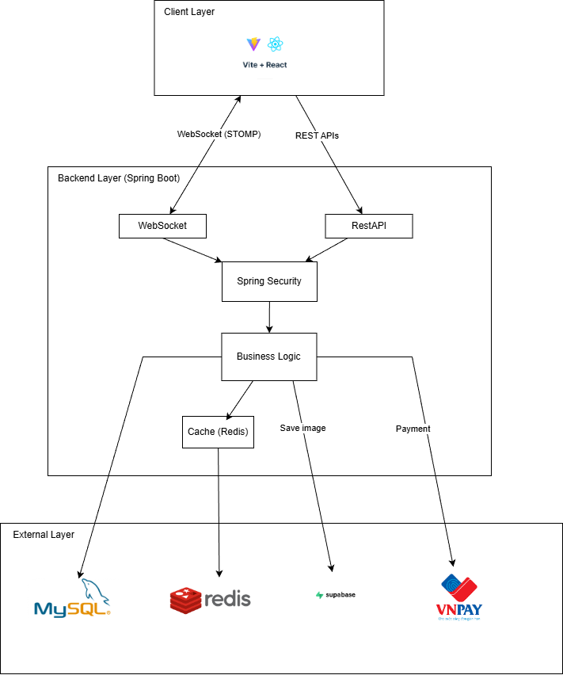
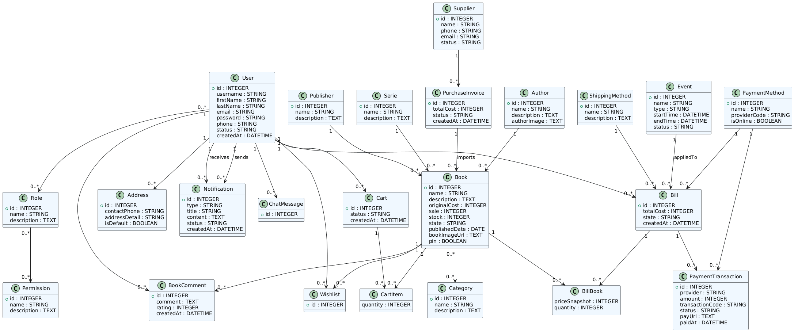
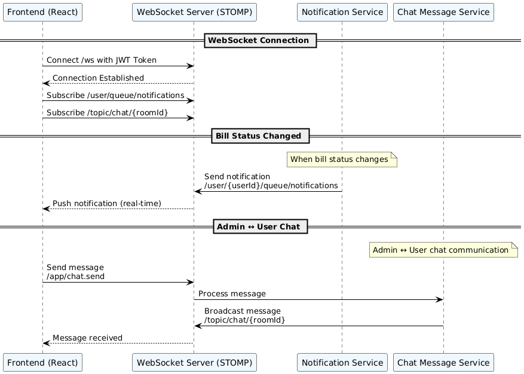
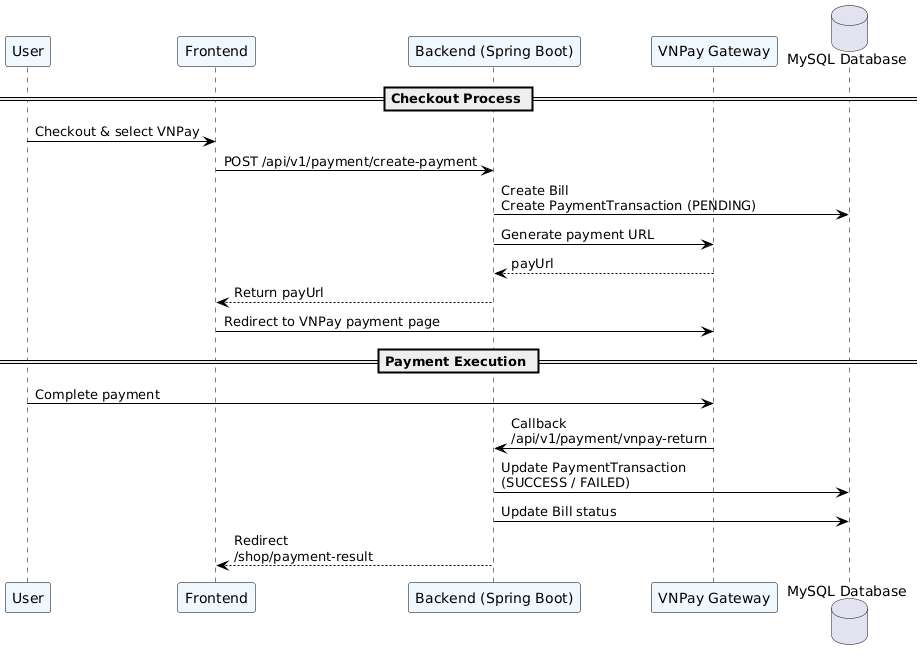
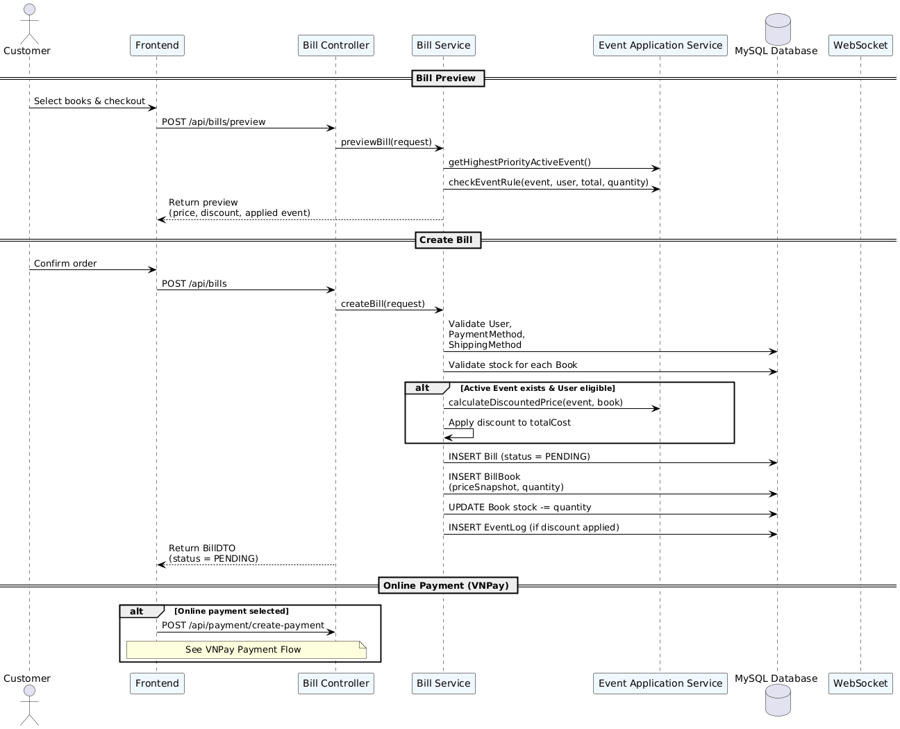
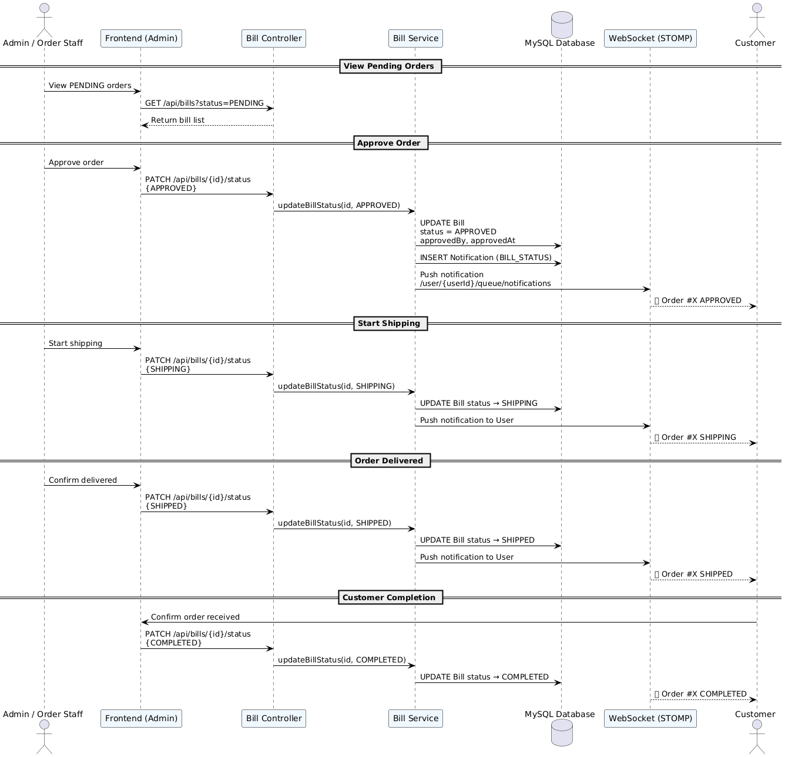
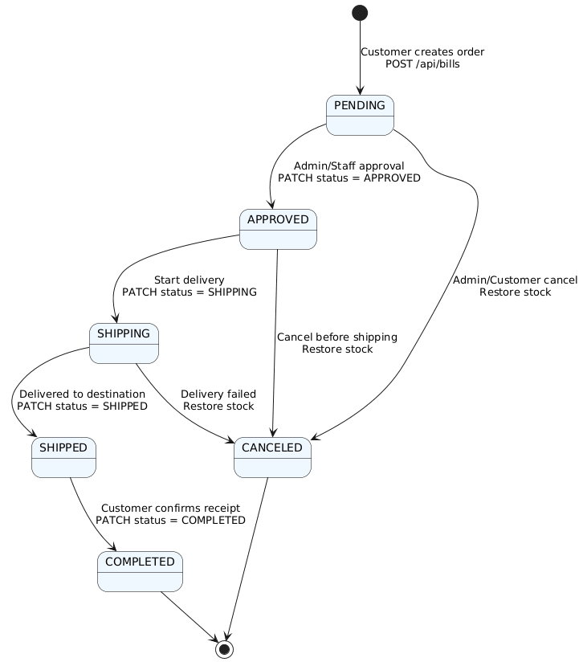

# PTIT BookLand

> An online bookstore management system built for the **Web Programming** course, further developed for the **E-Commerce System Development** course at PTIT.

---

## Project Structure

```
PTIT_BookLand/
├── BookLand_BE/        # Backend — Spring Boot 3 (Java)
├── BookLand_FE/        # Frontend — React 18 + TypeScript + Vite
└── BookLand_DB/        # Database schema & migration scripts
```

---

## Technologies

| Layer | Technologies |
|---|---|
| **Frontend** | React 18, TypeScript, Vite, Axios, STOMP.js |
| **Backend** | Spring Boot 3, Java, Spring Security, Spring Data JPA |
| **Database** | MySQL 8 |
| **Cache** | Redis |
| **Auth** | JWT (custom) |
| **Payment** | VNPay |
| **Storage** | Supabase Storage |
| **Real-time** | WebSocket (STOMP over SockJS) |
| **API Docs** | Swagger / OpenAPI |
| **Deploy** | AWS (BE), Vercel / Static (FE) |

---

## System Architecture Diagrams

### 1. System Context Overview


### 2. Database Entity Diagram (UML Class Diagram)


### 3. WebSocket & Real-time Flow


### 4. VNPay Payment Flow


---

### 5. Order Lifecycle (Bill Lifecycle)

#### 5.1 Sequence Diagram — Create Order


#### 5.2 Sequence Diagram — Review & Process Order (Admin/Staff)


#### 5.3 State Diagram — Order Lifecycle


> **Business Rules:**
> - Every status change triggers a **real-time Notification** via WebSocket to the customer
> - On `CANCELED`: **stock is automatically restored** for all books in the order
> - `COMPLETED` and `CANCELED` are **terminal states** — no further transitions are allowed
> - Only `ADMIN`, `MANAGER`, and `ORDER_STAFF` roles can update order status
